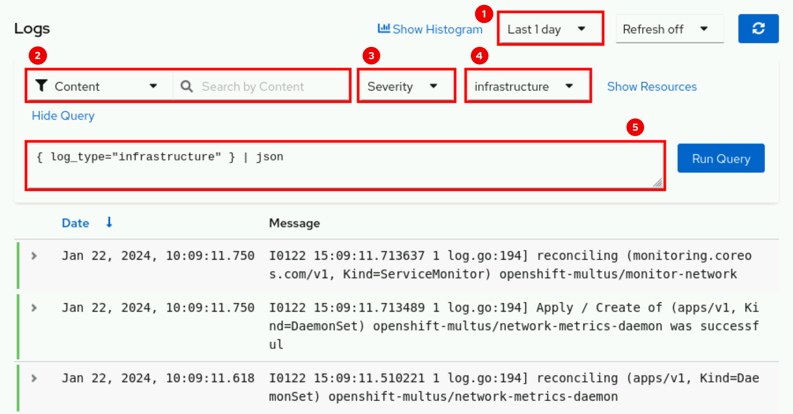
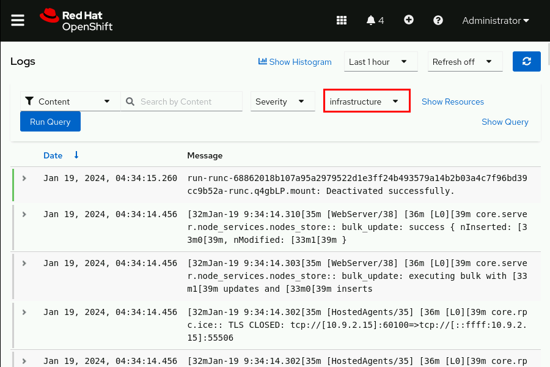

# Configuration de Loki et OpenShift Logging

Ce guide explique comment configurer Loki pour la collecte et le stockage des logs avec OpenShift Logging. Deux options sont disponibles :  
1. Utiliser un backend S3 externe (AWS S3, MinIO, ou autre).  
2. Utiliser OpenShift Data Foundation (ODF) pour le stockage S3 interne.

---

## Prérequis

- Un cluster OpenShift configuré.
- Soit un service S3 externe compatible, soit OpenShift Data Foundation (ODF) installé.
- Pour un backend S3 externe :  
  - **Access Key**, **Secret Key**, **Bucket Name** et **Endpoint URL**.
  - Si nécessaire, un certificat CA pour un endpoint S3 auto-signé.

---

## Option 1 : Utiliser un backend S3 externe

### Étape 1.1 : Créer le Secret pour S3 externe

Créez un secret contenant vos identifiants S3 et informations de connexion :

```
oc create secret generic logging-loki-s3 -n openshift-logging \
  --from-literal=access_key_id=<ACCESS_KEY> \
  --from-literal=access_key_secret=<SECRET_KEY> \
  --from-literal=bucketnames=<BUCKET_NAME> \
  --from-literal=endpoint=<S3_ENDPOINT_URL>
```
Remplacez :

<ACCESS_KEY> : Clé d'accès S3.
<SECRET_KEY> : Clé secrète S3.
<BUCKET_NAME> : Nom du bucket.
<S3_ENDPOINT_URL> : URL d'accès au service S3 (par exemple s3.amazonaws.com ou l'URL MinIO).

### Étape 1.2 : Ajouter un certificat TLS (si requis)
Si votre S3 utilise un certificat , suivez ces étapes pour ajouter le certificat CA :

Exportez le certificat CA : s3-ca.crt
Créez un ConfigMap pour le certificat :

```
oc create configmap s3-ca-cert -n openshift-logging --from-file=ca.crt=s3-ca.crt
```
### Étape 1.3 : Configurer LokiStack pour S3 externe
Créez un fichier lokistack-s3.yaml :

```
Copier le code
apiVersion: loki.grafana.com/v1
kind: LokiStack
metadata:
  name: logging-loki
  namespace: openshift-logging
spec:
  size: 1x.demo
  storage:
    secret:
      name: logging-loki-s3
      type: s3
    tls:
      caName: s3-ca-cert # Facultatif, utilisez si un certificat auto-signé est utilisé.
  tenants:
    mode: openshift-logging
```
Appliquez cette configuration :

```
oc apply -f lokistack-s3.yaml
```
##  Option 2 : Utiliser OpenShift Data Foundation (ODF)

### Étape 2.1 : Créer une revendication de bucket

Créez un fichier loki-bucket-claim.yaml :

```
apiVersion: objectbucket.io/v1alpha1
kind: ObjectBucketClaim
metadata:
  name: loki-bucket-odf
  namespace: openshift-logging
spec:
  generateBucketName: loki-bucket-odf
  storageClassName: openshift-storage.noobaa.io
Appliquez cette configuration :
```

```
oc apply -f loki-bucket-claim.yaml
```

###  Étape 2.2 : Créer un Secret basé sur le bucket ODF
Une fois le bucket créé, exécutez les commandes suivantes pour générer un secret :

```
oc create secret generic logging-loki-odf -n openshift-logging \
  --from-literal=access_key_id=$(oc get -n openshift-logging secret loki-bucket-odf -o jsonpath='{.data.AWS_ACCESS_KEY_ID}' | base64 -d) \
  --from-literal=access_key_secret=$(oc get -n openshift-logging secret loki-bucket-odf -o jsonpath='{.data.AWS_SECRET_ACCESS_KEY}' | base64 -d) \
  --from-literal=bucketnames=$(oc get -n openshift-logging configmap loki-bucket-odf -o jsonpath='{.data.BUCKET_NAME}') \
  --from-literal=endpoint=https://$(oc get -n openshift-logging configmap loki-bucket-odf -o jsonpath='{.data.BUCKET_HOST}'):$(oc get -n openshift-logging configmap loki-bucket-odf -o jsonpath='{.data.BUCKET_PORT}')
```

###  Étape 2.3 : Configurer LokiStack pour ODF
Créez un fichier lokistack-odf.yaml :

```
apiVersion: loki.grafana.com/v1
kind: LokiStack
metadata:
  name: logging-loki
  namespace: openshift-logging
spec:
  size: 1x.demo
  storage:
    secret:
      name: logging-loki-odf
      type: s3
    tls:
      caName: openshift-service-ca.crt
  tenants:
    mode: openshift-logging
Appliquez cette configuration :
```
```
oc apply -f lokistack-odf.yaml
```

##  Étapes communes pour OpenShift Logging

###  Étape 3 : Configurer ClusterLogging

Créez un fichier clusterlogging.yaml :

```
apiVersion: logging.openshift.io/v1
kind: ClusterLogging
metadata:
  name: instance
  namespace: openshift-logging
spec:
  collection:
    type: vector
  logStore:
    lokistack:
      name: logging-loki
    type: lokistack
  visualization:
    type: ocp-console
  managementState: Managed
```
Appliquez cette configuration :

```
oc apply -f clusterlogging.yaml
```

###  Étape 4 : Configurer ClusterLogForwarder
Créez un fichier clusterlogforwarder.yaml :

```
apiVersion: logging.openshift.io/v1
kind: ClusterLogForwarder
metadata:
  name: instance
  namespace: openshift-logging
spec:
  pipelines:
  - name: all-to-default
    inputRefs:
    - infrastructure
    - application
    - audit
    outputRefs:
    - default
```

Appliquez cette configuration :

```
oc apply -f clusterlogforwarder.yaml
```
##  Vérifications
Vérifiez que tous les pods dans le namespace openshift-logging sont en état Running :

```
oc get pods -n openshift-logging
```
Accédez à l’interface d’OpenShift Console pour visualiser les logs.


1- Plage de temps des journaux.

2- Filtrage des journaux par contenu, namespace, pod ou conteneur.

3- Niveau de gravité du journal. Les valeurs possibles sont critical, error, warning, debug, info, trace et unknown.

4- Type de journal. Les valeurs possibles sont application, infrastructure et audit.

5- Requête de journal dans le langage de requête LogQL. Vous pouvez afficher ce champ en cliquant sur Show Query.



